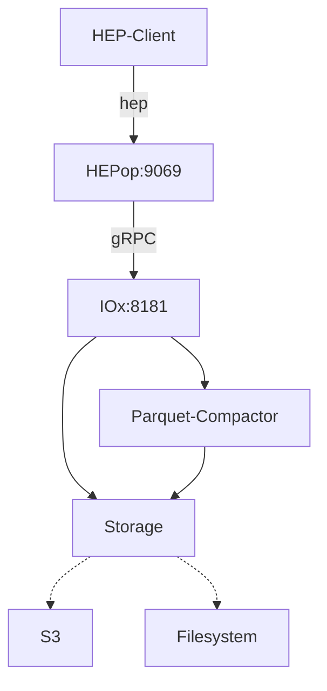

# 

**HEPop** is a prototype stand-alone [HEP](https://github.com/sipcapture/hep) Capture Server in Bun designed for [HOMER](https://github.com/sipcapture/homer)

> This is a work in progress. Do not use it!

##### Features

- Bun Server
- InfluxDB3/FlightSQL API
- Object Storage, Parquet




### Install & Build

Use Bun to generate a bundled standalone binary for `hepop`

```bash
bun install
bun build ./hepop.js --compile --outfile hepop
```

### Run
Configure the client using ENV variables
```
  INFLUX_HOST: "http://influxdb3:8181"
  INFLUX_TOKEN: "optional"
  INFLUX_DATABASE: "hep"
```
Run the HEP Server
```bash
./hepop
```

## Example
The repository includes a stand-alone example using hepop and influxdb3 with file storage
```
docker compose up
```
