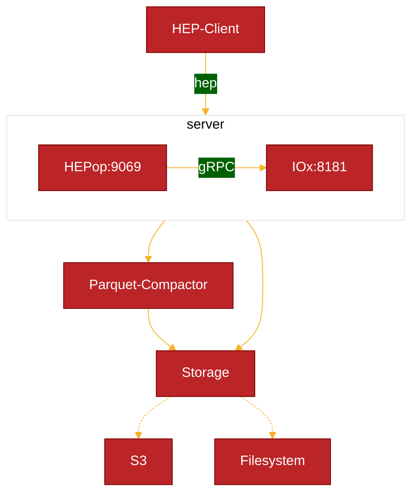

# 

**HEPop** is a prototype stand-alone [HEP](https://github.com/sipcapture/hep) Capture Server in Bun designed for [HOMER](https://github.com/sipcapture/homer)

> This is a work in progress. Do not use it!

##### Features

- [x] Bun Server
  - [x] hep-js sockets
  - [ ] parsip extractor
- [x] InfluxDB3/FlightSQL API
  - [x] Object Storage, Parquet
- [ ] HOMER Search API




### Install & Build

Use Bun to generate a bundled standalone binary for `hepop`

```bash
bun install
bun build ./hepop.js --compile --outfile hepop
```

### Run
Configure the client using ENV variables
```
  INFLUX_HOST: "http://influxdb3:8181"
  INFLUX_TOKEN: "optional"
  INFLUX_DATABASE: "hep"
```
Run the HEP Server
```bash
./hepop
```

## Example
The repository includes a stand-alone example using hepop and influxdb3 with file storage
```
docker compose up
```

### Ingestion
Just send hep to the server using UDP/TCP. Each HEP type will generate a table _(hep_1, hep_100, etc)_

### Query
Query the HEP data using the HTTP API or Flight SQL
#### API
```bash
curl http://127.0.0.1:8181/api/v3/query_sql --data '{"db": "hep", "q": "select * from hep_1 limit 1"}'
```
```json
[{"capture_id":2001,"capture_pass":"myHep","correlation_id":"067d3@127.0.0.1","dst_ip":"192.168.1.2","dst_port":5060,"ip_family":2,"payload":"OPTIONS sip:127.0.0.1 SIP/2.0Call-ID: 067d3@127.0.0.1CSeq: 9999 OPTIONSFrom: <sip:nodejs@127.0.0.1>;tag=2628881569To: <sip:nodejs@127.0.0.1>Via: SIP/2.0/UDP 127.0.0.1:48495;branch=z9hG4bK9b82aa8fb4c7705466a3456dfff7f384333332Max-Forwards: 70User-Agent: HEPGEN-UACContent-Length: 0","proto_type":0,"protocol":17,"src_ip":"192.168.1.1","src_port":5060,"time":"2025-01-26T18:44:07.120","time_sec":1737917047,"time_usec":120000,"type":"1"}]
```
#### Flight
```sql
influxdb3 query --database hep "SELECT * FROM hep_1 limit 1"
```
```sql
+------------+--------------+-----------------+-------------+----------+-----------+------------------------------------------------------------------------------------------------------------------------------------------------------------------------------------------------------------------------------------------------------------------------------------------+------------+----------+-------------+----------+-------------------------+------------+-----------+------+
| capture_id | capture_pass | correlation_id  | dst_ip      | dst_port | ip_family | payload                                                                                                                                                                                                                                                                                  | proto_type | protocol | src_ip      | src_port | time                    | time_sec   | time_usec | type |
+------------+--------------+-----------------+-------------+----------+-----------+------------------------------------------------------------------------------------------------------------------------------------------------------------------------------------------------------------------------------------------------------------------------------------------+------------+----------+-------------+----------+-------------------------+------------+-----------+------+
| 2001       | myHep        | 067d3@127.0.0.1 | 192.168.1.2 | 5060     | 2         | OPTIONS sip:127.0.0.1 SIP/2.0Call-ID: 067d3@127.0.0.1CSeq: 9999 OPTIONSFrom: <sip:nodejs@127.0.0.1>;tag=2628881569To: <sip:nodejs@127.0.0.1>Via: SIP/2.0/UDP 127.0.0.1:48495;branch=z9hG4bK9b82aa8fb4c7705466a3456dfff7f384333332Max-Forwards: 70User-Agent: HEPGEN-UACContent-Length: 0 | 0          | 17       | 192.168.1.1 | 5060     | 2025-01-26T18:44:07.120 | 1737917047 | 120000    | 1    |
+------------+--------------+-----------------+-------------+----------+-----------+------------------------------------------------------------------------------------------------------------------------------------------------------------------------------------------------------------------------------------------------------------------------------------------+------------+----------+-------------+----------+-------------------------+------------+-----------+------+
```

### Query API
Query the HEP data using the HTTP API. The server provides both GET and POST endpoints for querying data.

#### GET /query
```bash
# Query last 10 minutes of SIP messages
curl "http://localhost:9070/query?q=SELECT time,src_ip,dst_ip,payload FROM hep_1"

# Query specific time range with conditions
curl "http://localhost:9070/query?q=SELECT time,src_ip,dst_ip,payload FROM hep_1 \
  WHERE time >= '2025-02-08T19:00:00' \
  AND time < '2025-02-08T20:00:00' \
  AND payload LIKE '%INVITE%' \
  ORDER BY time DESC \
  LIMIT 100"
```

#### POST /query
```bash
# Simple query with POST
curl -X POST http://localhost:9070/query \
  -H "Content-Type: application/json" \
  -d '{
    "query": "SELECT time, src_ip, dst_ip FROM hep_1 LIMIT 10"
  }'

# Complex query with time range and conditions
curl -X POST http://localhost:9070/query \
  -H "Content-Type: application/json" \
  -d '{
    "query": "SELECT time, src_ip, dst_ip, payload FROM hep_1 WHERE time >= '\''2025-02-08T19:00:00'\'' AND payload LIKE '\''%INVITE%'\'' ORDER BY time DESC"
  }'
```

#### Response Format
```json
[
  {
    "time": "2025-02-08T19:00:01.120",
    "src_ip": "192.168.1.1",
    "dst_ip": "192.168.1.2",
    "payload": "INVITE sip:alice@domain.com SIP/2.0..."
  },
  {
    "time": "2025-02-08T19:00:02.350",
    "src_ip": "192.168.1.2",
    "dst_ip": "192.168.1.1",
    "payload": "SIP/2.0 200 OK..."
  }
]
```

#### Query Features
- **Time Range**: If not specified, defaults to last 10 minutes
- **Dynamic Columns**: Select specific columns or use * for all
- **Filtering**: WHERE clause supports standard SQL conditions
- **Sorting**: ORDER BY supports all columns
- **Pagination**: Use LIMIT and OFFSET for paging
- **Multiple Types**: Query different HEP types (hep_1, hep_100, etc.)

#### Common Queries
```sql
-- Get recent INVITE messages
SELECT time, src_ip, dst_ip, payload 
FROM hep_1 
WHERE payload LIKE '%INVITE%'
ORDER BY time DESC
LIMIT 100

-- Get call statistics for last hour
SELECT 
  src_ip,
  COUNT(*) as message_count,
  MIN(time) as first_message,
  MAX(time) as last_message
FROM hep_1
WHERE time >= '2025-02-08T19:00:00'
GROUP BY src_ip
ORDER BY message_count DESC

-- Get failed calls
SELECT time, src_ip, dst_ip, payload
FROM hep_1
WHERE payload LIKE '%SIP/2.0 4%'
  OR payload LIKE '%SIP/2.0 5%'
ORDER BY time DESC
```
