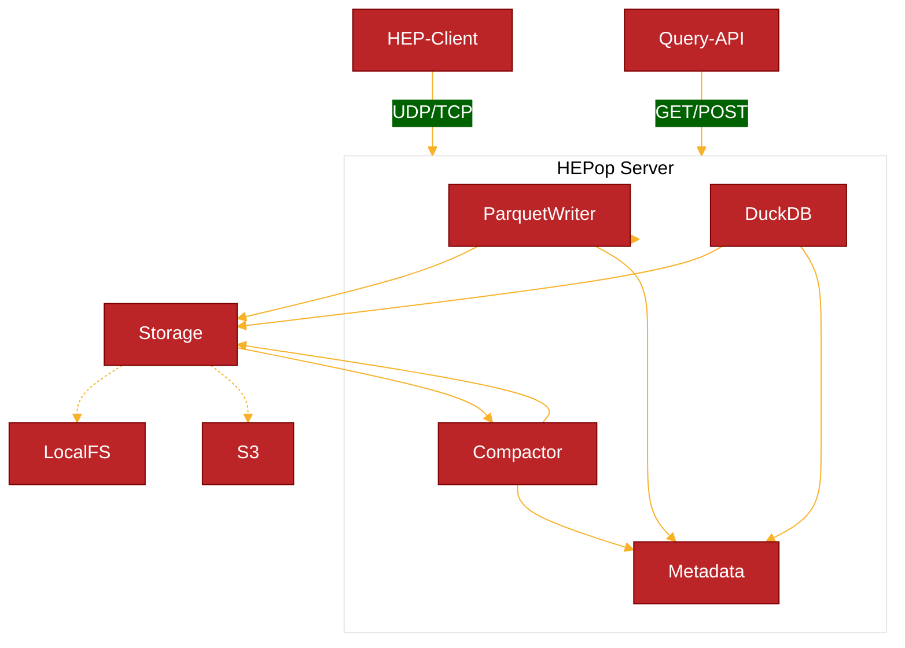

# 

> **HEPop** is a high-performance [HEP](https://github.com/sipcapture/hep) Capture Server built with DuckDB, Bun and Apache Arrow/Parquet


##### Features

- [x] High-Performance HEP Server
  - [x] HEPv3/EEP Support (UDP/TCP)
- [x] Apache Parquet Writer
  - [x] Parquet Columnar WAL + Storage
  - [x] Automatic Rotation + Compaction
  - [x] Automatic Metadata Management
- [x] DuckDB Integration
  - [x] Parquet Data Compaction
  - [x] Query Execution
- [x] Search API
  - [x] GET/POST Query API 
  - [x] Metadata Table/Range Selection 




### Install & Build

Use Bun to generate a bundled standalone binary for `hepop`

```bash
bun install
bun start
```

### Configuration
Configure HEPop using Environment variables:
- `PORT`: HEP server port _(default: 9069)_
- `HTTP_PORT`: Query API port _(default: PORT + 1)_
- `HOST`: Bind address _(default: "0.0.0.0")_
- `PARQUET_DIR`: Data directory _(default: "./data")_
- `WRITER_ID`: Instance identifier _(default: hostname)_


### Run
Start the HEP Server:
```bash
./hepop
```

### Storage Structure
HEPop organizes data in a time-based directory structure:
```
data/
└── writer1/
    └── dbs/
        └── hep-0/
            ├── hep_1-0/
            │   └── 2025-02-08/
            │       ├── 19-00/
            │       │   └── c_0000000001.parquet
            │       ├── 19-10/
            │       │   └── 0000000002.parquet
            │       └── metadata.json
            └── hep_100-0/
                └── ...
```

- Each HEP type gets its own directory structure
- Generated Parquet files are organized by date and hour
- Compacted sets (c_) consolidate files for fast access
- Metadata tracks all files, compaction and statistics

```json
{
  "type": 1,
  "parquet_size_bytes": 379739,
  "row_count": 359,
  "min_time": 1739043338978000000,
  "max_time": 1739043934193000000,
  "wal_sequence": 32,
  "files": [
    {
      "id": 0,
      "path": "data/writer1/dbs/hep-0/hep_1-0/2025-02-08/19-00/c_0000000032.parquet",
      "size_bytes": 379739,
      "row_count": 359,
      "chunk_time": 1739043000000000000,
      "min_time": 1739043338978000000,
      "max_time": 1739043934193000000,
      "range": "1h",
      "type": "compacted"
    }
  ]
}

```


### Query API
Query the HEP data using the HTTP API. The server provides both GET and POST endpoints for querying data.

#### Query Features
- **Time Range**: If not specified, defaults to last 10 minutes
- **Dynamic Columns**: Select specific columns or use * for all
- **Filtering**: WHERE clause supports standard SQL conditions
- **Sorting**: ORDER BY supports all columns
- **Pagination**: Use LIMIT and OFFSET for paging
- **Multiple Types**: Query different HEP types (hep_1, hep_100, etc.)


#### Available Fields:
- `timestamp/time`: Event timestamp
- `rcinfo`: Raw HEP protocol header _(JSON)_
- `payload`: HEP Protocol payload
- `src_ip`: Source IP _(extracted from rcinfo)_
- `dst_ip`: Destination IP _(extracted from rcinfo)_
- `src_port`: Source port _(extracted from rcinfo)_
- `dst_port`: Destination port _(extracted from rcinfo)_


#### GET /query
```bash
# Query last 10 minutes of SIP messages
curl "http://localhost:9070/query?q=SELECT time,src_ip,dst_ip,payload FROM hep_1 LIMIT 10"

#### POST /query
```bash
# Simple query with POST
curl -X POST http://localhost:9070/query \
  -H "Content-Type: application/json" \
  -d '{
    "query": "SELECT time, src_ip, dst_ip FROM hep_1 LIMIT 10"
  }'

# Complex query with time range and conditions
curl -X POST http://localhost:9070/query \
  -H "Content-Type: application/json" \
  -d '{
    "query": "SELECT time, src_ip, dst_ip, payload FROM hep_1 WHERE time >= '\''2025-02-08T19:00:00'\'' AND payload LIKE '\''%INVITE%'\'' ORDER BY time DESC"
  }'
```

#### OLAP Query
Query HEP data using DuckDB, ClickHouse, Databend or any Parquet-compatible tool:
```sql
SELECT count() FROM 'data/writer1/dbs/hep-0/hep_1-*/*/*/c_0000000001.parquet' LIMIT 10;
```


## License
©️ QXIP BV - Released under the AGPLv3 Open Source License.
