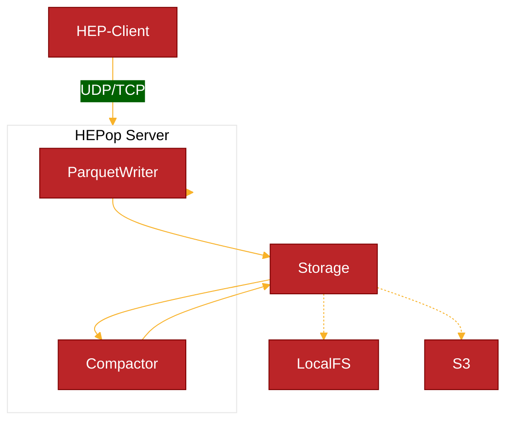

# 

**HEPop** is a high-performance [HEP](https://github.com/sipcapture/hep) Capture Server built with Bun, designed for efficient packet capture and storage using Apache Parquet.

##### Features

- [x] High-Performance Bun Server
  - [x] HEP/EEP Packet Support (UDP/TCP)
- [x] Apache Parquet Writer
  - [x] Parquet Columnar WAL + Storage
  - [x] Automatic Rotation + Compaction
  - [x] Time-Based Directory Structure
  - [x] Metadata Management
- [x] DuckDB Integration
  - [x] Parquet Data Compaction
  - [x] Query Parquet
- [ ] HOMER Search API



### Install & Build

Use Bun to generate a bundled standalone binary for `hepop`

```bash
bun install
bun build ./hepop.js --compile --outfile hepop
```

### Configuration
Configure the server using ENV variables:
```bash
PORT=9898              # Server port (default: 9069)
HOST=0.0.0.0          # Server host (default: 0.0.0.0)
PARQUET_DIR=./data    # Data directory (default: ./data)
WRITER_ID=writer1     # Unique writer ID (default: hostname)
```

### Run
Start the HEP Server:
```bash
./hepop
```

### Storage Structure
HEPop organizes data in a time-based directory structure:
```
data/
└── writer1/
    └── dbs/
        └── hep-0/
            ├── hep_1-0/
            │   └── 2025-02-08/
            │       ├── 19-00/
            │       │   └── c_0000000001.parquet
            │       ├── 19-10/
            │       │   └── 0000000002.parquet
            │       └── metadata.json
            └── hep_100-0/
                └── ...
```

- Each HEP type gets its own directory
- Files are organized by date and hour
- Raw files are written every 10 minutes
- Compacted files (c_) consolidate older data
- Metadata tracks all files and statistics

### Features
- **Automatic Compaction**: Older files are automatically compacted for better storage efficiency
- **Restart Safety**: Metadata ensures consistency across restarts
- **Directory Cleanup**: Empty directories from past hours are automatically removed
- **Type Isolation**: Each HEP type is stored and managed separately
- **Atomic Operations**: All file and metadata operations are atomic

### Query
Query the HEP data using DuckDB or any Parquet-compatible tool:
```sql
SELECT * FROM 'data/writer1/dbs/hep-0/hep_1-0/2025-02-08/19-00/c_0000000001.parquet' LIMIT 1;
```
