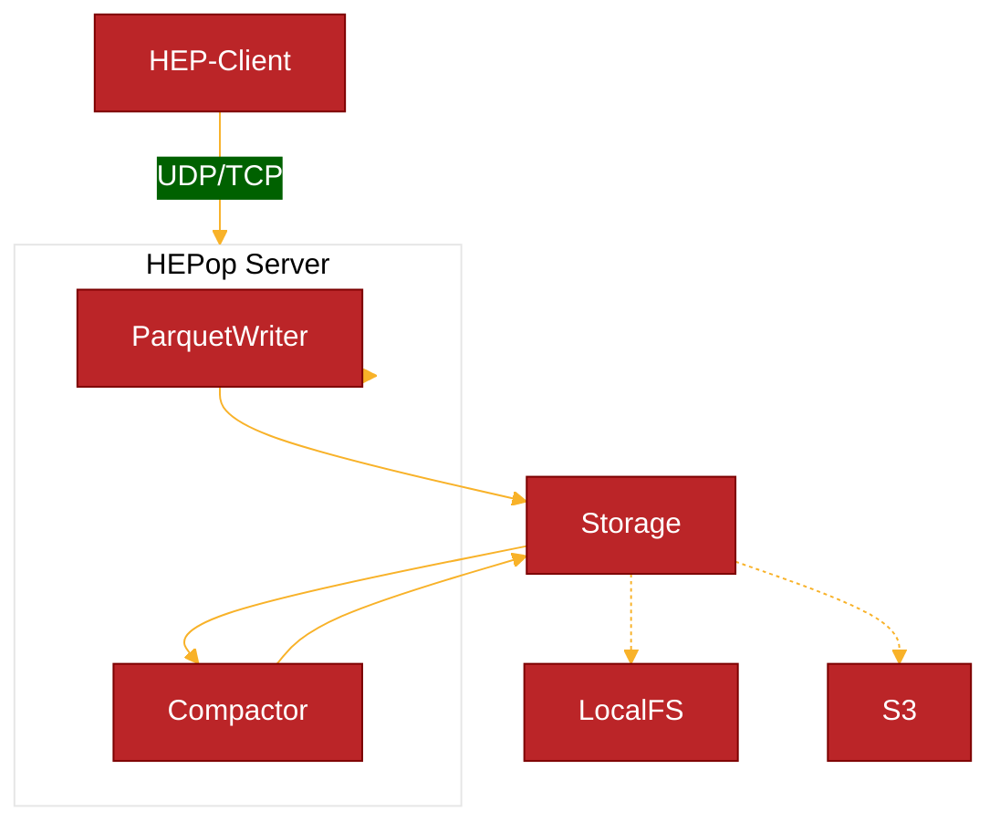

# 

**HEPop** is a high-performance [HEP](https://github.com/sipcapture/hep) Capture Server built with Bun and designed for Apache Parquet + Object Storage.

##### Features

- [x] High-Performance Bun Server
  - [x] HEP/EEP Packet Support (UDP/TCP)
- [x] Apache Parquet Writer
  - [x] Parquet Columnar WAL + Storage
  - [x] Automatic Rotation + Compaction
  - [x] Time-Based Directory Structure
  - [x] Metadata Management
- [x] DuckDB Integration
  - [x] Parquet Data Compaction
  - [x] Query Parquet
- [ ] HOMER Search API



### Install & Build

Use Bun to generate a bundled standalone binary for `hepop`

```bash
bun install
bun build ./hepop.js --compile --outfile hepop
```

### Configuration
Configure the server using ENV variables:
```bash
PORT=9898             # Server port (default: 9069)
HOST=0.0.0.0          # Server host (default: 0.0.0.0)
PARQUET_DIR=./data    # Data directory (default: ./data)
WRITER_ID=writer1     # Unique writer ID (default: hostname)
```

### Run
Start the HEP Server:
```bash
./hepop
```

### Storage Structure
HEPop organizes data in a time-based directory structure:
```
data/
└── writer1/
    └── dbs/
        └── hep-0/
            ├── hep_1-0/
            │   └── 2025-02-08/
            │       ├── 19-00/
            │       │   └── c_0000000001.parquet
            │       ├── 19-10/
            │       │   └── 0000000002.parquet
            │       └── metadata.json
            └── hep_100-0/
                └── ...
```

- Each HEP type gets its own directory structure
- Generated Parquet files are organized by date and hour
- Compacted sets (c_) consolidate files for fast access
- Metadata tracks all files, compaction and statistics

```json
{
  "type": 1,
  "parquet_size_bytes": 379739,
  "row_count": 359,
  "min_time": 1739043338978000000,
  "max_time": 1739043934193000000,
  "wal_sequence": 32,
  "files": [
    {
      "id": 0,
      "path": "data/writer1/dbs/hep-0/hep_1-0/2025-02-08/19-00/c_0000000032.parquet",
      "size_bytes": 379739,
      "row_count": 359,
      "chunk_time": 1739043000000000000,
      "min_time": 1739043338978000000,
      "max_time": 1739043934193000000,
      "range": "1h",
      "type": "compacted"
    }
  ]
}

```


### Features
- **Automatic Compaction**: Older files are automatically compacted for better storage efficiency
- **Restart Safety**: Metadata ensures consistency across restarts
- **Directory Cleanup**: Empty directories from past hours are automatically removed
- **Type Isolation**: Each HEP type is stored and managed separately
- **Atomic Operations**: All file and metadata operations are atomic

### Query
Query HEP data using DuckDB, ClickHouse, Databend or any Parquet-compatible tool:
```sql
SELECT * FROM 'data/writer1/dbs/hep-0/hep_1-*/*/*/c_0000000001.parquet' LIMIT 10;
```

### Query API
Query the HEP data using the HTTP API. The server provides both GET and POST endpoints for querying data.

#### GET /query
```bash
# Query last 10 minutes of SIP messages
curl "http://localhost:9070/query?q=SELECT time,src_ip,dst_ip,payload FROM hep_1"

# Query specific time range with conditions
curl "http://localhost:9070/query?q=SELECT time,src_ip,dst_ip,payload FROM hep_1 \
  WHERE time >= '2025-02-08T19:00:00' \
  AND time < '2025-02-08T20:00:00' \
  AND payload LIKE '%INVITE%' \
  ORDER BY time DESC \
  LIMIT 100"
```

#### POST /query
```bash
# Simple query with POST
curl -X POST http://localhost:9070/query \
  -H "Content-Type: application/json" \
  -d '{
    "query": "SELECT time, src_ip, dst_ip FROM hep_1 LIMIT 10"
  }'

# Complex query with time range and conditions
curl -X POST http://localhost:9070/query \
  -H "Content-Type: application/json" \
  -d '{
    "query": "SELECT time, src_ip, dst_ip, payload FROM hep_1 WHERE time >= '\''2025-02-08T19:00:00'\'' AND payload LIKE '\''%INVITE%'\'' ORDER BY time DESC"
  }'
```

#### Response Format
```json
[
  {
    "time": "2025-02-08T19:00:01.120",
    "src_ip": "192.168.1.1",
    "dst_ip": "192.168.1.2",
    "payload": "INVITE sip:alice@domain.com SIP/2.0..."
  },
  {
    "time": "2025-02-08T19:00:02.350",
    "src_ip": "192.168.1.2",
    "dst_ip": "192.168.1.1",
    "payload": "SIP/2.0 200 OK..."
  }
]
```

#### Query Features
- **Time Range**: If not specified, defaults to last 10 minutes
- **Dynamic Columns**: Select specific columns or use * for all
- **Filtering**: WHERE clause supports standard SQL conditions
- **Sorting**: ORDER BY supports all columns
- **Pagination**: Use LIMIT and OFFSET for paging
- **Multiple Types**: Query different HEP types (hep_1, hep_100, etc.)

#### Common Queries
```sql
-- Get recent INVITE messages
SELECT time, src_ip, dst_ip, payload 
FROM hep_1 
WHERE payload LIKE '%INVITE%'
ORDER BY time DESC
LIMIT 100

-- Get call statistics for last hour
SELECT 
  src_ip,
  COUNT(*) as message_count,
  MIN(time) as first_message,
  MAX(time) as last_message
FROM hep_1
WHERE time >= '2025-02-08T19:00:00'
GROUP BY src_ip
ORDER BY message_count DESC

-- Get failed calls
SELECT time, src_ip, dst_ip, payload
FROM hep_1
WHERE payload LIKE '%SIP/2.0 4%'
  OR payload LIKE '%SIP/2.0 5%'
ORDER BY time DESC
```

# HEPop.js

HEPop.js is a high-performance HEP Capture Server with built-in compression and indexing capabilities.

## Features
- HEP/EEP Packet Reception (TCP/UDP)
- Parquet File Storage with Compression
- Automatic File Rotation and Compaction
- SQL Query Interface
- High-Performance Data Access

## Installation
```bash
npm install hepop
```

## Usage

### Start Server
```javascript
import { HEPServer } from 'hepop';

const server = new HEPServer();
await server.initialize();
```

### Query Interface
HEPop.js provides a SQL query interface accessible via HTTP. Queries can be executed using either GET or POST methods.

#### Example Queries:
```bash
# Using POST
curl -X POST http://localhost:9070/query \
  -H "Content-Type: application/json" \
  -d '{
    "query": "SELECT * FROM hep_1 LIMIT 10"
  }'

# Query with time range and conditions
curl -X POST http://localhost:9070/query \
  -H "Content-Type: application/json" \
  -d '{
    "query": "SELECT time, src_ip, dst_ip, payload FROM hep_1 WHERE time >= '\''2025-02-08T19:00:00'\'' AND payload LIKE '\''%INVITE%'\'' ORDER BY time DESC"
  }'

# Using GET
curl "http://localhost:9070/query?q=SELECT%20*%20FROM%20hep_1%20LIMIT%2010"
```

#### Available Fields:
- `timestamp/time`: Event timestamp
- `rcinfo`: Raw protocol information (JSON)
- `payload`: SIP/Protocol payload
- `src_ip`: Source IP (extracted from rcinfo)
- `dst_ip`: Destination IP (extracted from rcinfo)
- `src_port`: Source port (extracted from rcinfo)
- `dst_port`: Destination port (extracted from rcinfo)

## Configuration
Environment variables:
- `PORT`: HEP server port (default: 9069)
- `HTTP_PORT`: Query API port (default: PORT + 1)
- `HOST`: Bind address (default: "0.0.0.0")
- `PARQUET_DIR`: Data directory (default: "./data")
- `WRITER_ID`: Instance identifier (default: hostname)

## License
MIT
